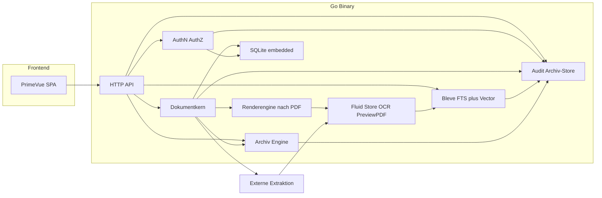
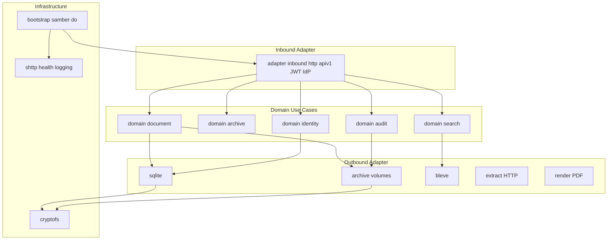

# Arcivio – SOHO Dokumentenmanagement

Architektur- und Umsetzungsplan: selbsttragendes SOHO-DMS mit Go-Backend, PrimeVue-Frontend, eingebettetem Speicher, eigener AuthN/AuthZ inkl. SSO sowie integriertem, signierbarem Append-Only-Archiv und Bleve (Volltext + Vektoren).

## Aktueller Stand (2026-09-21)

**Phase 1 (Gerüst) und Phase 2 Auth lokal sind fachlich erfüllt.** **Phase 3 UI-Gerüst (App-Shell, Theme, Einstellungen-Rahmen) ist erfüllt**; Settings-Masken und Client-Fachnavigation fehlen noch. Feingranular-RBAC an der API fehlt noch.

Vorhanden:

- Go-Modul `github.com/willie68/arcivio`, Servicename `arcivio`, Go 1.26
- Repo-Layout: `backend/` (Go), `frontend/` (Vite/Vue), `bruno/`, `scripts/`
- Clean/Hexagonal: `backend/cmd/service`, `backend/internal/bootstrap`, `backend/internal/config`, `backend/internal/infrastructure/{shttp,health,logging}`, `backend/internal/adapter/inbound/http/{api,apiv1,auth,idp}`
- YAML-Config (`-c`, `${}`, `secretfile`), Logging inkl. GELF/VictoriaLogs, OTEL, Prometheus
- Outbound `adapter/outbound/store` mit `type: sqlite` (`modernc.org/sqlite`) und `adapter/outbound/identity/sqlite` (Tabelle `users`, inkl. `last_login`)
- Domain `identity` (User, Argon2id, Bootstrap, Passwortwechsel, CreateUser, LastLogin bei erfolgreichem Login)
- Domain `idp`: interner OIDC-IdP (Authorization Code + PKCE S256, RS256 JWT, JWKS)
- HTTP `/auth` (Discovery, JWKS, authorize, login, change-password, token, userinfo, logout); JWT nur auf `/api/v1`
- `GET /api/v1/me` (inkl. `lastLogin`), `POST /api/v1/me/password` (Passwortwechsel angemeldet)
- Stub-Domain `internal/domain/document` (Port `Store.Ping`, Use Case `Status`)
- Vue 3 + PrimeVue 4 Aura + Vite + Vue Router + vue-i18n (`de`/`en` nach Browser) in `frontend/`
- `scripts/build.cmd` baut zuerst das Frontend nach `backend/pkg/web/client`, danach das Binary
- SPA unter HTTPS `/` und `/client/`; Login mit Lockup-Logo, Pflichtwechsel, OIDC-Callback
- App-Shell: Header (Marke + Zahnrad/Hilfe/Benutzer), Client-Bereich, Footer (Copyright→README, GitHub)
- Client-Bereich umschaltbar: **Arcivio Client** (Start) und **Arcivio Einstellungen** (Zahnrad bleibt eingedrückt)
- Benutzer-Menü: Mein Konto (Dialog), Passwort ändern (Dialog im Client-Bereich), Info, Logout
- Einstellungen: Baum links inkl. Filter, Seite in der Mitte, kontextuelle Hilfe rechts; live, ohne Save
- Settings-Platzhalter (Blätter): Benutzer, Rollen, Ablagen, Dokumenttypen, externe Systeme
- Vite-Dev (`npm run dev`, Port 5173) proxyt `/auth`, `/api`, `/swagger`, `/livez`, `/readyz` zum Go-HTTPS
- Health `/livez` `/readyz`, Swagger `/swagger/` (`/me`), `data/` und `frontend/node_modules/` gitignored
- JWT aktiv (`auth.type: jwt`); Signaturprüfung über den IdP-Verifier
- Bruno-Collection `arcivio` (Health + Auth Discovery/JWKS/`/me` unauth)
- Workspace `Arcivio.code-workspace`; `scripts/build.cmd` schreibt `backend/bin/arcivio.exe`

Vorlagenreste (Tenant, Bruno-Address, Postman, `gomicro`-Namen) sind entfernt. `pkg/pmodel` und `pkg/client` existieren nicht (Address-Client bewusst entfernt, pmodel nie mitkopiert).

Nächster Schritt: **Settings-Masken** (Benutzerverwaltung zuerst, live ohne Save). Danach Fachlogik **Dokumente + Typen + Blob-Store**. Client-Module Ablage/Suche/Archiv kommen mit der Fach-UI. RBAC-Durchsetzung mit den ersten Fach-APIs; OIDC Entra/Apple bleibt Phase 10.

## Offene Arbeitspakete

- [x] go-micro (Clean/Hexagonal) nach Arcivio kopieren, Address-Demo entfernen, PrimeVue in `backend/pkg/web/client`
- [x] Vorlagenreste: Tenant-Pflicht/Claims entfernt, Bruno ohne Address-Vars, Docker/Makefile-Binary `arcivio`
- [x] Interner IdP: lokale Nutzer (Argon2id), OIDC Code+PKCE, JWT-Validierung, Bootstrap-Admin + Pflichtwechsel
- [x] UI-Gerüst: App-Shell, Aura, i18n DE/EN, Client/Einstellungen-Toggle, User-Menü, Settings-Baum mit 5 Platzhalterseiten
- [ ] Settings-Masken live ohne Save (Benutzer, Rollen, Ablagen, Dokumenttypen, externe Systeme)
- [ ] RBAC an der API durchsetzen (Rollen am User/JWT vorhanden; Permissions `document.create` etc. fehlen)
- [ ] Dokumenttypen als Schema mit archival vs. fluid Attributen, Blob-Store, Versionen nur bei archival Änderungen, fluider Sidecar-Speicher
- [ ] Selbsttragende DOC-Envelopes, Löschen per DEL-Record im aktuellen Volume (alte Container unverändert), Restore, Siegel/Signatur
- [ ] Auditlog: bereichsweise YAML-Schalter, AUDIT-Envelopes im Auto-Store `_audit`, Admin-Einsicht, Hash-Kette, keine Rekursion
- [ ] Optionale PQC-At-Rest-Verschlüsselung: ML-KEM-Hybrid wrappt AES-256-GCM-DEK für Archiv, Fluid, Working, SQLite (und Bleve); Default aus
- [ ] Extractor-Adapter, Bleve FTS mit KV-Attributen, Query-Parser (Phrase, Wildcard, AND/OR, Range, Klammern), Vector/Hybrid
- [ ] Blobview: native Image/PDF; Outbound-Render wandelt EML/MSG/Office nach PDF als fluides File-Attribut; Frontend PDF-Anzeige
- [ ] PrimeVue: Ablage, Typen, Suche (ein Suchfeld), Archiv-Status, Audit-Store (Admin), Benutzerverwaltung, Blobview
- [ ] Hilfesystem: kontextsensitive Hilfe DE/EN in der SPA; bis dahin verweist „?“ auf die GitHub-README

## Annahmen

- **Projektname:** Arcivio (Go-Modul `github.com/willie68/arcivio`)
- **Pfad:** `H:\privat\git-sourcen\Arcivio`
- **Archiv:** pragmatisch **GoBD-tauglich** (Unveränderbarkeit softwareseitig, Hash, Signatur, Audit, Aufbewahrung) – **kein** BSI TR-ESOR
- **SSO:** lokale Konten plus **OIDC** für **Microsoft Entra ID** und **Sign in with Apple**; macOS-Kerberos/Open Directory später optional
- **Go-Gerüst:** erledigt – Kopie der damaligen `go-micro`-Clean/Hexagonal-Struktur, Address-Demo entfernt
- **Frontend:** Vue 3 + PrimeVue 4 Aura (Vite) in `frontend/`, SPA in `backend/pkg/web/client` eingebettet (App-Shell, i18n, Settings-Gerüst)

Keine Zertifizierung und keine Rechtsberatung: das System liefert technische Nachvollziehbarkeit; Verfahrensdokumentation bleibt organisatorisch.

## Zielbild

Ein-Binary-DMS für kleine Büros: beliebige Dateien ablegen, frei definierbare Dokumenttypen, Volltext- und KI-Suche, integriertes Archiv in wachsenden Containerdateien, Signatur mit internem oder externem Zertifikat. Extraktion/OCR und Embeddings kommen über Adapter von **externen** Services.



## Tech-Stack

**Go-Teil = Clean Architecture** mit hexagonalen Inbound-/Outbound-Adaptern (nicht das alte `internal/services`-Layout). Basis war `go-micro`; Arcivio ist diese Struktur, umbenannt und ohne Address-Demo.

Schichten (Abhängigkeiten nur nach innen; Domain kennt keine Adapter):



Übernommen und im Repo:

- Go 1.26, Chi, **samber/do** v2, Wiring in `internal/bootstrap` (`InitServices` + `Provide` je Paket)
- YAML-Config (`internal/config`, `-c`, `${}`, `secretfile`)
- Infrastructure: `shttp`, `health`, `logging` (slog, GELF, VictoriaLogs), OTEL, Prometheus
- Inbound: `adapter/inbound/http` (apiv1, JWT in `.../auth`, IdP unter `/auth`, Swagger UI)
- Outbound: Ports in Domain-Paketen (`document.Store`, `identity.UserStore`); Implementierung + Factory unter `adapter/outbound/{store,identity}`
- `internal/shared` (serror, httputils), `backend/pkg/web` Embed, `backend/api/` Swagger, `bruno/`, `scripts/`, `frontend/`
- Docker-Build: Binary `arcivio`, Image `mcs/arcivio` (`scripts/dockerbuild.cmd`)

Entfernt bzw. ersetzt:

- Demo-Bounded-Context **addresses** (`domain/addresses`, `adapter/outbound/address`, Address-Handler, `pkg/client`) – **Code weg**; Bruno-Address-Requests und Postman ebenfalls entfernt
- **Keine externe DB:** Factory `storage.type: sqlite` (`modernc.org/sqlite`); kein MySQL
- Modulname **`github.com/willie68/arcivio`**, Servicename `arcivio`

Noch geplant (als Domain + Ports + Adapter, nicht als `internal/services`):

- **Suche:** Bleve v2 (Text + Vector, Build-Tag `vectors`) als Outbound
- **Krypto:** SHA-256, CMS/PKCS#7; At-Rest PQC in Infrastructure `cryptofs`
- **AuthZ:** Permission-Checks an Fach-APIs; Admin-User-API; externes OIDC (Entra/Apple)
- **Frontend:** Kernflows in PrimeVue (Login/Startseite existieren)

## Datenmodell (Kern)

- **User / Role / Permission / Group**
- **DocumentType:** Name, Schema der Metafelder, Default-Aufbewahrung, Archivpflicht
- **Document:** Typ, Status (`inbox` / `active` / `archived`), MIME, Originalname, Verweis auf aktuelle Blob-Version
- **Version:** nur wenn sich **archival** Inhalt oder **archival** Attribute ändern; Blob nie überschreiben
- **RetentionPolicy** und **LegalHold**
- **AuditEvent:** wer/was/wann/Bereich/Ergebnis, Hash-Kette; Speicherung nur im Audit-Archiv-Store, nicht als fluides SQLite-Log
- **ArchiveVolume / ArchiveRecord:** Container, Offset, Länge, Record-Hash, Siegel/Signatur
- **ExtractorJob:** Queue für externe Services
- **SearchDoc:** Bleve-ID = Dokument-UUID; Index speist sich aus archival + aktuellem fluidem Stand

Dokumenttypen sind **Daten**, kein Hardcode. UI rendert Felder aus dem Schema.

### Archival vs. fluide Attribute

Jedes Feld (Metadatum) am Typ hat `persistence: archival | fluid`.

**Archival (archivierungswürdig)** – Teil der revisionssicheren Identität:

- Originaldatei (Bytes), Content-Hash, Dateiname/MIME zum Archivzeitpunkt
- Geschäftliche Festschreibungen: Rechnungsnummer, Betrag, Vertragsparteien, Belegdatum, Aufbewahrungsfrist, Dokumenttyp
- Gehen ins Archiv-Volume (`META` + `BLOB`); Änderung **nach** Archivierung erzeugt eine **neue Version** und einen neuen Archiv-Record (oder ist verboten, je nach Typ/Rolle)

**Fluid** – Ableitungen und Hilfsdaten, nicht identitätsstiftend:

- OCR-/Extractor-Volltext, Konfidenz, Sprachcode, Embedding-Vektoren, KI-Zusammenfassung, nachträglich korrigierte Suchbegriffe, UI-Tags ohne Rechtswirkung
- **Fluide Dateiattribute** (eigene Dateien im Fluid Store, nicht im Archiv): insbesondere **Prerender-PDF** (`previewPdf`) für die Blob-Anzeige; gebunden an Content-Hash des Quell-Blobs, bei neuer Engine überschreibbar ohne Dokumentversion
- Aus **Nutzersicht** am Dokument sichtbar (eine Maske, ein Datensatz)
- Technisch **eigener Nicht-Archiv-Speicher** (SQLite + optional Dateien unter `data/derived/<doc-id>/`), keyed nur über Dokument-ID, **ohne** Volume-Append
- Nach Archivierung **beliebig ersetzbar** (neue OCR, bessere KI): kein neues Dokument, keine Blob-Version, Archiv-Siegel unberührt
- Bleve wird bei fluidem Update neu geschrieben; Suchtreffer folgen dem aktuellen fluiden Stand

Schema-Beispiel (konzeptuell): `invoiceNumber` archival, `ocrFulltext` / `embedding` fluid. Systemfelder `fulltext` und `embedding` sind immer fluid, auch ohne Typ-Definition.

Regel: Versionierung entscheidet sich am **archival Diff**, nicht am OCR-Ergebnis.

## Speicherung und Archiv

Drei Schichten:

1. **Working Store:** Originale als Content-Addressed Blobs (`data/blobs/ab/cd/<sha256>`), **archival** Metadaten in SQLite. Alltag, Vorschau, erneutes Archivieren.
2. **Fluid Store (kein Archiv):** Volltexte, Embeddings, Ableitungen und **Prerender-PDFs** (`data/derived/…` + SQLite-Tabellen `document_fluid`). Überschreibbar; optional Historie der letzten N Läufe nur für Nachvollziehbarkeit, **nicht** siegelrelevant.
3. **Archiv:** Append-Only-**Volumes**, z. B. `archive/vol-000042.arc`. Pro archivierter Dokumentversion **ein selbsttragendes Objekt** (Envelope). Fluid wird **nicht** in den Container geschrieben.

**Selbsttragendes Archivobjekt:** Ein Record enthält alles, was nötig ist, das Dokument **allein aus den Containern** wiederherzustellen – ohne SQLite, ohne Working-Blobs, ohne Fluid Store:

- Dokument-ID, Versionsnummer, Archivzeitpunkt, Retention/LegalHold
- **Snapshot des Dokumenttyps** (ID, Name, Schema der archival Felder zum Archivzeitpunkt), damit Felder ohne aktuelle Typ-Registry lesbar bleiben
- alle **archival** Attribute (JSON)
- Originalbytes, MIME, Originaldateiname, Content-Hash
- optional Vorgänger-Versions-ID

Kein Verweis nach außen (kein Blob-Pfad, keine DB-ID als einzige Quelle). Ein Dokument darf nicht auf mehrere Records/Volumes aufgeteilt werden, außer der Envelope selbst liegt vollständig in einem Volume; sehr große Dateien: ein Envelope mit eingebettetem Payload, notfalls ein Volume nur für dieses Objekt. SQLite ist ein **Index/Cache** über die Container, nicht die Quelle der Wahrheit für archivierte Dokumente.

**Wiederherstellung (Disaster Recovery / Migration):** Volumes in ID-/Zeitreihenfolge scannen → `DOC` anwenden → spätere `DEL` für dieselbe Dokument-/Versions-ID ausblenden → Working Store und Metadaten neu aufbauen. **Fluide Attribute werden nicht wiederhergestellt**. Nach Restore: nicht gelöschte Dokumente und archival Felder vorhanden, OCR/Volltext/Embeddings leer. Bei At-Rest-Verschlüsselung ist der KEK/Passphrase nötig.

**Löschen im Archiv (Tombstone, Append-Only):** Es wird **nicht** im Volume geändert, das den `DOC`-Record trägt (wichtig, wenn versiegelte Container auf Read-only-/WORM-Medien liegen). Stattdessen hängt das System an das **aktuell offene** Volume einen **`DEL`-Record** (Dokument-ID, Versions-ID, Zeitpunkt, Akteur-Referenz, Grund/Retention). Ist kein Volume offen (alles versiegelt), wird ein neues Volume nur für Folge-Records inkl. `DEL` eröffnet. Replay: letzter `DEL` gewinnt gegenüber älterem `DOC`. Die Originalbytes bleiben im alten Container; Speicherfreigabe höchstens später durch optionales Umkopieren in neue Volumes, nie durch Patch des alten Files. Working Store/SQLite/Index: Dokument als gelöscht führen. Fluid darf mitgelöscht werden (kein Archiv). Steuerrelevante Typen: Vier-Augen vor dem `DEL`-Append.

**Audit:** Jedes Archiv-Löschen wird **immer** als Audit-Event geschrieben (nicht abschaltbar), unabhängig von `document.cud`.

**Containerformat (einfach, inkrementell):** eigenes Binary-Format, nicht ZIP (Append bei ZIP ist unzuverlässig).

- Dateikopf: Magic `ARCV`, Version, Volume-ID
- Records nacheinander: `len | type | payload | sha256`
- Record-Typen: `DOC` (Dokument-Envelope), `DEL` (Löschdatensatz, verweist auf DOC-ID/Version), `AUDIT` (nur Store `_audit`), `MANIFEST`, `SEAL`
- Offenes Volume wächst nur am Ende (O_APPEND)
- Ab Schwelle (z. B. 256–512 MiB) oder Zeitplan: **SEAL** (Manifest aller Record-Hashes + Merkle-Root) und **CMS-Signatur** mit internem oder importiertem Zertifikat
- Danach Volume read-only; neues Volume. Read-only-Medien: nur **versiegelte** Volumes auslagern; `DEL` lebt danach nur auf beschreibbaren Folgevolumes.

Integrität: Record-Hashes, Volume-Merkle-Root, Signatur, periodische Verify-Jobs. Fluide Daten können mit dem Dokument logisch gelöscht oder unabhängig neu erzeugt werden.

Signierung: interne CA (erster Admin erzeugt Root+Signing-Cert, Root offline/exportierbar) oder PKCS#12/PEM-Import. Signiert wird das **Siegel**; jedes `DOC`- und `DEL`-Envelope ist über Hash im Manifest gebunden. Fluide Attribute sind **nicht** Teil der Signatur.

## At-Rest-Verschlüsselung (optional, PQC)

Alle Dateien auf dem Speicherlaufwerk (Working-Blobs, Fluid/`data/derived`, Archiv-Volumes inkl. `_audit`, **SQLite-Datei**) können **optional** verschlüsselt werden. Default: **aus**. Ein Schalter pro Server in `service.yaml`; Schlüssel nur in `secretfile`.

**Ziel:** Schutz ruhender Daten (Diebstahl/Backup-Medium), nicht TLS. TLS bleibt klassisch oder separat.

**Konstruktion (hybrid, post-quantum-tauglich):**

- **DEK:** AES-256-GCM (symmetrisch mit 256-bit gilt als PQ-resistent genug)
- **Wrap der DEK:** Hybrid-KEM **ML-KEM-768** (FIPS 203) plus klassisch **X25519**, z. B. über Cloudflare CIRCL; beide Shares kombinieren (z. B. HKDF), bevor die DEK entschlüsselt wird
- Unlock beim Start: Passphrase und/oder Keyfile aus `secret.yaml` (nicht in Git)
- Dateiformat: kurzer Klartext-Header (`ARCE`, Algorithmen-IDs, KEM-Ciphertexts, Nonce-Salt), danach Ciphertext
- Ein DEK für die Instanz, rotiierbar (Re-Wrap; optionales Re-Encrypt der Dateien als Admin-Job)

**SQLite:** nicht unverschlüsselt daneben legen. Page-Level-VFS (AES-256-GCM pro Seite, DEK wie oben), damit die DB weiter normale Datei-I/O nutzt. Kein SQLCipher (nur AES, kein PQC-KEM). WAL/SHM liegen hinter demselben VFS.

**Bleve-Index:** ebenfalls über denselben verschlüsselten Dateizugriff, sonst läge Volltext klartextlich neben den Stores.

Modul: `internal/infrastructure/cryptofs` (oder Outbound-File-Port). Archive-/Fluid-/Working-/Store-Backends schreiben nur darüber. Unverschlüsseltes Alt-Verzeichnis: einmalige Migration beim ersten Einschalten.

```yaml
storage:
  encryption:
    enabled: false          # Default aus
    kem: ml-kem-768-x25519  # Hybrid
    dataCipher: aes-256-gcm
    # kekFile / passphrase: nur secret.yaml
```

Ohne `enabled` bleiben Dateien Klartext wie bisher. Umschalten auf an ohne Migration ist ein Fehlerstart (Header fehlt bzw. Klartext erkannt).

## Extraktion und Suche

- Adapter-Interface: HTTP-Callback oder Webhook (`POST /extract` an konfigurierbare URL, Ergebnis `text` + optionale `embedding[]`)
- DMS enthält **keinen** OCR/Parser
- Pipeline: Upload → Blob → Job → Ergebnis in **Fluid Store** → Bleve-Index
- Erneute Extraktion nach Archivierung: gleicher Dokument- und Blob-Hash, Fluid überschreiben, Index aktualisieren, **keine** neue Version
- **Index-Mapping ohne Field-Explosion:** keine dynamischen Top-Level-Felder pro Metadatum. Indexierbare Attribute (archival + fluid, soweit suchbar) als Liste:

```json
"Attributes": [
  {"Key": "color", "Value": "red"},
  {"Key": "size", "Value": "XL"},
  {"Key": "weight", "Value": "10kg"}
]
```

Nested/Bleve: `Attributes` wiederholt, `Key` keyword, `Value` text (Analyzer + n-gram/reverse für führende Wildcards), zusätzlich typisiert `ValueNum` / `ValueDate` wenn das Schema Zahl oder Datum ist. `fulltext` und `embedding` bleiben eigene Felder. Attributsuche: Conjunction `Key=<name>` AND (`Value`/`ValueNum`/`ValueDate` je Query).
- Query-Parser in `domain/search` (eigene Grammatik, nicht Bleve-Query-String), Outbound Bleve übersetzt Boolean/Wildcard/Phrase/Range/Nested
- GET Dokument: eine Ressource; Response trennt intern `archival` und `fluid`, UI zeigt beides zusammen

## Use Case Blobview

Der Client zeigt den **aktuellen Original-Blob** (archival) an. Die Anzeige hängt vom MIME/Typ ab; das Original bleibt unverändert.

**Nativ (kein Prerender):**

- Bilder: JPEG, PNG, GIF, WebP, BMP – HTML-`` / einfacher Image-Viewer
- PDF: nativer PDF-Viewer im Frontend (z. B. pdf.js)

**Prerender (fluides Dateiattribut `previewPdf`):**

- EML, MSG, Office (mindestens DOCX, ODT; analog ODS/ODP/XLSX/PPTX sofern die Engine sie kann)
- der Render-Use-Case wandelt den Original-Blob nach **PDF** und legt das Ergebnis als **fluides File-Attribut** ab (`data/derived/<doc-id>/preview.pdf` plus Metadaten: MIME, Größe, Quell-Hash, Engine-Version)
- Frontend zeigt dieses PDF im **gleichen PDF-Viewer** wie native PDFs
- Fehlt das Prerender oder ist der Quell-Hash veraltet: Job anstoßen, UI „wird vorbereitet“; nach Archivierung erneutes Rendern **ohne** neue Dokumentversion
- Nach Restore aus Containern fehlt `previewPdf` (fluid) – Rendern läuft neu

**Renderengine:** Domain-Port + Outbound `adapter/outbound/render` (LibreOffice/soffice, EML/MSG→PDF). Nicht der externe OCR-Extractor. Konfigurierbarer Binary-Pfad in `service.yaml`. Formate ohne Viewer und ohne Engine: Download-only.

Audit: Anzeige folgt `document.blobRead` (Default aus).

## Use Case einfache Suche

Ein Suchfeld. Die Zeichenkette wird vom Parser interpretiert (Groß/Kleinschreibung der Operatoren wie `+` und `=` streng; Terme default case-insensitive). Audit: `index.search` (Default aus).

**Volltext** (Feld `fulltext`, OCR + suchbare Texte):

- `Wilfried` – Term
- `"Wilfried Klaas"` – Phrase
- `Wilf*` – Prefix-Wildcard (Wörter mit Präfix `wilf`)
- `Wilf?` – genau ein Zeichen nach `wilf` (`Wilf1`, `Wilfr`, `wilfa`; nicht `wilf12`, nicht `Wilfried`)
- `*fried` / `?fried` – führende Wildcard (über n-gram/reverse-Index, nicht naives Leading-Wildcard-Scan)

**Verknüpfung ohne Feld:**

- `Wilfried Klaas` – **ODER** (Dokumente mit Wilfried **oder** Klaas)
- `Wilfried +Klaas` – **UND** (`+` = Muss-Term)

**Attributsuche** (`Key=…` gegen `Attributes`; Phrase und Wildcards analog Volltext):

- `Name=Wilfried` – Feld `Name` enthält Term Wilfried
- `Name="Wilfried Klaas"` – Phrase im Feld
- `Name=Wilf*` / `Name=*fried` – Wildcards im Feld
- `Vorname=Wilfried +Name=Klaas` – UND über zwei Felder
- `Name=Klaas Name=Maier` – ODER im selben oder in Feldern (Juxtaposition = ODER)

**Klammern:** `(Name=Klaas +Vorname=Wilfried) +(Datum=16.02.26)` – Gruppe UND Datum. Datum `DD.MM.YY` oder `DD.MM.YYYY`.

**Bereiche** (`von..bis`, inklusiv):

- `16.02.26..17.02.26` – irgendein indexiertes Datum im Intervall
- `1234..1340` – irgendeine indexierte Zahl im Intervall
- `Datum=16.02.26..17.02.26` – nur Attribut `Datum`
- `Rechnungsnummer=1234..1340` – nur dieses Attribut

Parser-Fehler: HTTP 400, UI zeigt die Stelle. KI/Vektor-Suche ist ein **anderer** Modus (Toggle), nicht diese Grammatik.

## AuthN / AuthZ

Baut auf Template-JWT auf (`adapter/inbound/http/auth`, Config-Block `auth` in `service.yaml`). Use Cases in `domain/identity`; Persistenz Outbound SQLite.

**Interner IdP** (lokal, kein Keycloak): Benutzername + Argon2id-Passwort. HTTP-Adapter unter `/auth`, Domain `idp`. SSO (Entra/Apple) ist zusätzlich geplant; nach OIDC entsteht dasselbe interne JWT.

- JWT im Authorization-Header; Access-Token RS256, Prüfung über den IdP (JWKS)
- RBAC-Rollen am User und im Token: `admin`, `archivist`, `clerk`, `reader`; Feingranular `document.create`, `archive.seal`, `retention.dispose` **noch nicht** durchgesetzt
- Nutzerfeld `mustChangePassword` (boolean)
- Nutzerfeld `LastLogin` (*time.Time, SQLite `last_login`); wird bei erfolgreichem `Authenticate` gesetzt, `GET /api/v1/me` liefert `lastLogin`

**Bootstrap beim ersten Start:** Ist die Nutzertabelle leer, wird genau ein User `admin` mit Passwort `admin` und Rolle `admin` angelegt, `mustChangePassword=true`. Kein zweites automatisches Anlegen, wenn schon Nutzer existieren.

**Passwortänderungspflicht (interner IdP):**

- Login mit gültigem Passwort, aber `mustChangePassword`: kein Auth-Code. Nur `POST /auth/change-password` (alt + neu) im laufenden Authorize-Request. UI zwingt zur Änderung **bei/sofort nach** der ersten Anmeldung (Admin mit `admin` ebenso).
- Angemeldet: `POST /api/v1/me/password` (alt + neu) mit Bearer-Token; UI-Dialog im Client-Bereich.
- Nach erfolgreichem Wechsel: `mustChangePassword=false`, Redirect mit Code, danach Token-Austausch (PKCE).
- Legt ein User einen anderen User an: der interne IdP setzt ein **zufälliges** Einmalpasswort (nur einmal an den Anleger zurück, nicht persistiert im Klartext), Zieluser `mustChangePassword=true`. Gleiche Login-Regel. CreateUser ist Domain-Use-Case, noch ohne Admin-HTTP-API.

OIDC-Nutzer ohne lokales Passwort: kein `mustChangePassword` über dieses Passwort-Protokoll. TOTP später optional.

**Ist:** Interner IdP unter `/auth` (OIDC Authorization Code + PKCE S256, Discovery, JWKS). Passwörter nur als Argon2id-PHC in SQLite. `auth.type: jwt`; Middleware validiert Access-Token über den IdP. SPA-Login, `GET /api/v1/me` (inkl. LastLogin), `POST /api/v1/me/password`. Rollen liegen am User/JWT. **Nicht:** Permission-Checks, Benutzerverwaltung-API, Entra/Apple.

## Auditlog

Alle fachlichen Vorgänge können in ein **Auditlog** geschrieben werden. Das Log liegt **nicht** in SQLite als führendem Speicher, sondern direkt in einem **Archiv-Store** (gleiche Container-/Envelope-Technik wie Dokumente, Record-Typ `AUDIT`).

**System-Store `_audit`:** Beim ersten Start automatisch angelegt (Volumes unter `archive/_audit/`). Nur Rolle `admin` sieht und durchsucht ihn in der UI; kein normales Dokumentfach. Restore der Audit-Container stellt die Protokolle wieder her (selbsttragende Events inkl. Hash-Vorgänger). Schreiben ins Auditlog wird **nicht** rekursiv auditiert; Lesen des Audit-Stores folgt den Document-Read-Schaltern nicht, sondern einem eigenen Admin-Pfad ohne Extra-Audit (sonst Rekursion).

Jedes Event: Zeit (UTC), Akteur, Bereich, Aktion, Objekt-IDs, Ergebnis (ok/deny/fail), optionale Diff-Skizze (keine Passwörter, keine Blob-Bytes), `prevHash` + eigener Hash.

Schalter in `configs/service.yaml` (pro Server, nicht pro Tenant):

```yaml
audit:
  authn:
    logins: false          # erfolgreiche Logins (SSO und lokal); Default aus
    loginAttempts: false   # zusätzlich alle Versuche (Fail/Success); nur sinnvoll wenn logins oder dieses Flag an
    userManagement: true   # User Create/Update/Delete; Default ein
  authz:
    permissionManagement: true  # Create/Update/Delete von Rollen/Rechten; Default ein
  document:
    cud: true              # Dokument CUD; Default ein
    read: false            # Dokument Read; Default aus
    blobCud: true          # Blob CUD; Default ein
    blobRead: false        # Blob Read/Download; Default aus
  index:
    cud: false             # Index anlegen/ändern/löschen; Default aus
    search: false          # Suchanfragen; Default aus
```

`loginAttempts: true` bei `logins: false` protokolliert nur Fehlversuche (und konfigurierbar alle Versuche); bei beiden an: jeder Versuch plus Erfolg.

Fluide OCR-Updates zählen als Document-Update nur wenn `document.cud` an ist (kein Blob-CUD, Datei unverändert). Index-Rebuild nach OCR: `index.cud`, Default aus.

## Frontend (PrimeVue)

Selbsttragend: Vite-Build nach `backend/pkg/web/client` (über `scripts/build.cmd` vor dem Go-Build); HTTPS liefert SPA unter `/` und Assets unter `/client/`, plus `/api/v1`.

**Ist:** Vue Router (`/`, `/login`, `/callback`). PrimeVue Aura, vue-i18n (`de` wenn Browser-Sprache mit `de` beginnt, sonst `en`). App-Shell nach Login: Header (Marke, Zahnrad, Hilfe, Benutzer-Menü), Client-Bereich, einzeiliger Footer. Login mit Lockup-Logo; Pflichtwechsel und Callback im gleichen Look.

Der Client-Bereich zeigt entweder den **Arcivio Client** (Start, Default) oder **Arcivio Einstellungen** (Zahnrad-Toggle, Button bleibt eingedrückt). Einstellungen: Navigation als Baum inkl. Filter, mittig die Seite, rechts kontextuelle Hilfe. Gruppen können mehrstufig sein; jedes Blatt ist eine Seite, Titel `Ebene 1 - Ebene 2 - …`. Live-Einstellungen, kein Save. Aktuelle Wurzel-Blätter (Platzhalter): Benutzer, Rollen, Ablagen, Dokumenttypen, externe Systeme.

Benutzer-Menü: Mein Konto (Dialog inkl. LastLogin), Passwort ändern (Dialog zentriert im Client-Bereich, `POST /api/v1/me/password`), Info, Logout.

**Nächster UI-Schritt:** konkrete Settings-Masken (zuerst Benutzer), weiterhin live ohne Save. Client-Module Ablage/Suche/Archiv erst mit der Fach-UI (Phase 12). Desktop/Tablet zuerst; keine Feature-Screens (Upload, Liste, Blobview) in dieser Phase.

**Soll (MVP+, spätere Phasen):** Inbox/Upload, Dokumentliste + Filter, Dokumentdetail mit **Blobview**, Typschablonen-Editor, **ein Suchfeld**, Suche-KI-Toggle, Archiv-Volumes, **Audit-Store (Admin)**, Benutzer/Rollen, Extraktor-URL, SSO-Buttons, **Hilfesystem**.

## Hilfesystem

**Ist:** Header-Knopf „?“ öffnet die GitHub-README (`blob/main/README.md`) in einem neuen Tab. Gleiche URL wie der Copyright-Link im Footer. In den Einstellungen gibt es bereits eine rechte Hilfespalte (kurzer Text zur aktuellen Seite); das ist noch kein Artikel-Hilfesystem.

**Soll:** kontextsensitive Hilfe in der SPA, zweisprachig wie die übrige UI (`de`/`en` nach Browser).

- **Einstieg:** derselbe „?“-Knopf. Später öffnet er ein Hilfe-Panel (Drawer rechts oder eigene Route `/help`), nicht GitHub.
- **Kontext:** Topic-ID hängt an der aktuellen Route bzw. Maske (`login`, `account`, `inbox`, `document.detail`, `search`, `archive`, `admin.users`, …). Unbekanntes Topic fällt auf die Übersicht zurück.
- **Inhalt:** Markdown-Dateien im Repo, mitgeliefert im Frontend-Build (z. B. `frontend/src/help/{de,en}/*.md`). Kein externer CMS, keine Pflicht-Netzverbindung. Version der Hilfe = Produktversion.
- **Struktur:** kurze Artikel (Was ist das / Was tun / Hinweise), Querverweise, optional Anker auf PLAN-Kapitel nur für Entwickler – Anwenderhilfe bleibt fachlich und ohne Architekturjargon.
- **Suche:** ein Suchfeld über Titel und Volltext der lokalen Artikel (einfacher Client-Index reicht; kein Bleve).
- **Rollen:** Admin-Themen (Audit, Benutzer, Siegel) nur anzeigen, wenn die Rolle passt; gleiche Regel wie Navigation.
- **Offline/SOHO:** Hilfe bleibt im Binary. Der README-Link bleibt als „Projektseite / Mitmachen“ im Footer und im Info-Dialog, nicht als Ersatz für die Bedienungshilfe.

Umsetzung nach den ersten Fachmasken (Phase 12 oder mitziehend je Feature): jedes neue UI-Modul liefert seinen Hilfe-Artikel mit. Bis dahin bleibt „?“ = README.

## Repository-Struktur (Clean / hexagonal)

**Vorhanden:** `backend/cmd/service`, `backend/internal/bootstrap`, `backend/internal/config`, `backend/internal/infrastructure/{shttp,health,logging}`, `backend/internal/adapter/inbound/http/{api,apiv1,auth,idp}`, `backend/internal/adapter/outbound/{store,identity}/sqlite`, `backend/internal/domain/{document,identity,idp}`, `backend/internal/shared`, `backend/pkg/web`, `backend/api/`, `backend/configs/`, `bruno/`, `scripts/`, `frontend/`.

**Domain (Use Cases + Ports):**

- `internal/domain/document` – Typen, Versionen (archival Diff), Ports für Blob/Metadaten *(heute: nur Store-Ping)*
- `internal/domain/fluid` – OCR/Volltext/Embeddings/Prerender-PDF
- `internal/domain/archive` – selbsttragende Envelopes, `DEL`-Tombstones im offenen Volume, Restore, Siegel
- `internal/domain/audit` – Schalter, Hash-Kette, Port zum Audit-Store
- `internal/domain/search` – Query-Parser, Index-/Such-Port
- `internal/domain/identity` – lokaler User, Argon2id, mustChangePassword, LastLogin, Bootstrap-Admin, CreateUser *(vorhanden)*
- `internal/domain/idp` – interner OIDC-IdP (Code+PKCE, JWT, JWKS) *(vorhanden)*
- `internal/domain/extract` – Extraktionsjobs (Port nach außen)
- `internal/domain/render` – Prerender nach PDF

**Outbound – vorhanden / geplant:**

- `adapter/outbound/store/sqlite` – Factory `type: sqlite` *(vorhanden)*
- `adapter/outbound/identity/sqlite` – Tabelle `users` inkl. `last_login` *(vorhanden)*
- `adapter/outbound/blob` – Working-Blobs
- `adapter/outbound/archive` – Volume-Dateien
- `adapter/outbound/fluid` – derived files
- `adapter/outbound/search/bleve`
- `adapter/outbound/extract/http`
- `adapter/outbound/render`

**Inbound:** REST-Handler in `adapter/inbound/http/apiv1` rufen nur Domain-Interfaces auf, kein direkter Store-Zugriff. IdP-Handler unter `/auth`. *(heute: Health, Metrics, Swagger, SPA, `/auth/*`, `GET /api/v1/me`, `POST /api/v1/me/password`)*

**Infrastructure:** `cryptofs` für At-Rest *(geplant)*; Wiring in `bootstrap.InitServices` (`Provide` der Outbounds, dann `domain/*.Provide`, dann `shttp.Provide`).

Frontend-Quellen `frontend/` (u. a. `src/layouts`, `src/settings`, `src/i18n`, `src/assets/brand`), Output `backend/pkg/web/client`. Laufzeit `data/` und `frontend/node_modules/` gitignored.

## Umsetzungsphasen

### Phase 1 – Gerüst (erledigt)

Ziel war: lauffähiger Arcivio-Binary-Stub ohne Address-Demo, ohne DMS-Fachlogik.

Erledigt:

1. go-micro nach Arcivio kopiert, Modul/Servicename/Swagger auf `arcivio`
2. Address-Bounded-Context im Go-Code entfernt (`/api/v1/addresses` → 404)
3. Config `storage.type: sqlite`, Pfad `./data/arcivio.db`, Tabelle `schema_migrations`
4. `bootstrap.InitServices`: Health + shttp + SQLite-`Provide` + `domain/document`
5. Vite + Vue 3 + PrimeVue in `frontend/`, Build nach `backend/pkg/web/client`
6. `data/` und `frontend/node_modules/` in `.gitignore`
7. Bruno-Collection `arcivio`, Address-Requests und Postman entfernt
8. `scripts/build.cmd` baut Frontend, dann Swagger, dann `backend/bin/arcivio.exe`
9. Workspace `Arcivio.code-workspace`
10. Tenant-Header/-Claims und Address-Rollen aus Code/YAML entfernt; Docker/Makefile-Binary `arcivio`

Akzeptanzkriterien erfüllt: Binary mit `-c configs/service_local.yaml`; `/livez`, `/readyz`, `/swagger/` und SPA vom Binary (HTTPS `/` und `/client/`).

Aufräumarbeiten erledigt: Tenant-Header/-Claims, Bruno-Address-Vars, Docker/Makefile-Binary `arcivio`.

### Phase 2 – Auth lokal (IdP erledigt, RBAC-Durchsetzung offen)

Ziel: Nutzer kann sich mit Benutzername/Passwort anmelden; Passwörter nicht im Klartext; `/api/v1` nur mit JWT.

Erledigt:

1. Domain `identity`: User, Argon2id (PHC), Bootstrap `admin`/`admin` + `mustChangePassword`, CreateUser mit Zufallspasswort
2. Domain `idp`: OIDC Authorization Code + PKCE S256, RS256 Access-/ID-Token, JWKS
3. Inbound `/auth`: Discovery, JWKS, authorize, login, change-password, token, userinfo, logout
4. JWT-Middleware prüft Token über den IdP-Verifier; `/api/v1` ohne Token → 401
5. SPA Login + Pflichtwechsel + Callback; Vite-Proxy `/auth` und `/api`; Loopback-Redirects für Dev
6. SQLite-Tabelle `users`; Rollen-Konstanten am User und im JWT
7. Bruno Auth-Requests; Swagger `GET /api/v1/me`; `POST /api/v1/me/password`; LastLogin in Store und `/me`

Offen in dieser Phase: Permission-Checks und Admin-User-HTTP-API. Feingranulare Rechte (`document.create`, …) mit den Fach-APIs.

Akzeptanz erfüllt: Login Username/Passwort, kein Klartextpasswort in der DB, JWT für `/api/v1/me`.

### Phase 3 – Grundlegendes UI-Design (Gerüst erledigt)

Ziel: nach dem Login wirkt Arcivio wie eine Anwendung, nicht wie drei lose Seiten. Noch keine Dokument-Fachlogik.

Erledigt:

1. PrimeVue Aura, Brand-Marken, vue-i18n DE/EN nach Browser
2. App-Shell: Header (Logo, Zahnrad, Hilfe, Benutzer), Client-Bereich, Footer
3. Geschützte Route `/` in der Shell; `/login` und `/callback` ohne Shell
4. Client/Einstellungen-Toggle; Settings-Baum mit Filter; Platzhalterseiten Benutzer, Rollen, Ablagen, Dokumenttypen, externe Systeme; Hilfe-Spalte
5. User-Menü: Konto-Dialog, Passwort-Dialog (im Client-Bereich), Info, Logout
6. Startseite als Client-Platzhalter (Begrüßung)

Offen in dieser Phase: konkrete Settings-Masken (live, ohne Save), beginnend mit Benutzer.

Akzeptanz Gerüst: angemeldeter User sieht einheitliches Layout; Login sieht aus wie dasselbe Produkt.

### Weitere Phasen

4. **Dokumente + Typen + Blob-Store**
5. **Archiv-Volumes:** selbsttragende Envelopes, `DEL` im aktuellen Container, Restore, Siegel/Signatur
6. **Auditlog:** Store `_audit` auto-anlegen, YAML-Schalter, Hash-Kette
7. **At-Rest-Crypto:** optional ML-KEM-Hybrid + AES-256-GCM für alle Stores inkl. SQLite/Bleve
8. **Extractor-Adapter + Bleve FTS** (KV-Attribute, Query-Parser)
9. **Vektorfeld + Hybrid-Suche**
10. **OIDC Entra + Apple**
11. **Blobview:** native Viewer + Outbound-Render + fluides `previewPdf`
12. **Fach-UI** der Kernflows in der bestehenden Shell, Single-Binary-Release
13. **Hilfesystem:** In-App-Artikel DE/EN, kontextsensitiv zum „?“; README bleibt nur Projektlink

## Bewusst nicht im ersten Wurf

TR-ESOR/ERS, Hardware-WORM, S/MIME je Datei, Mandantenfähigkeit, Cluster, externe DB, eingebaute OCR.
